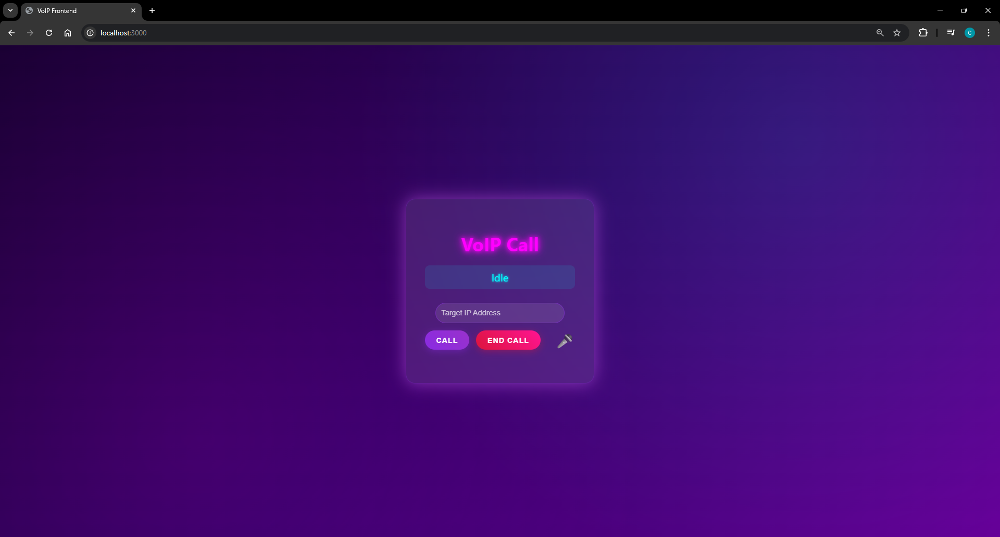
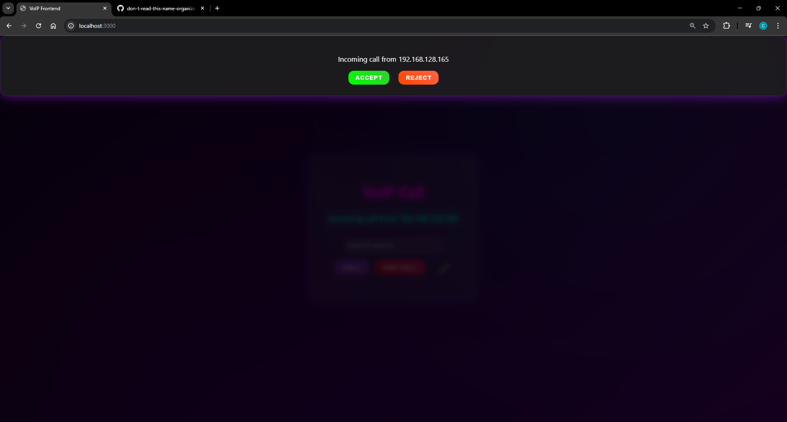
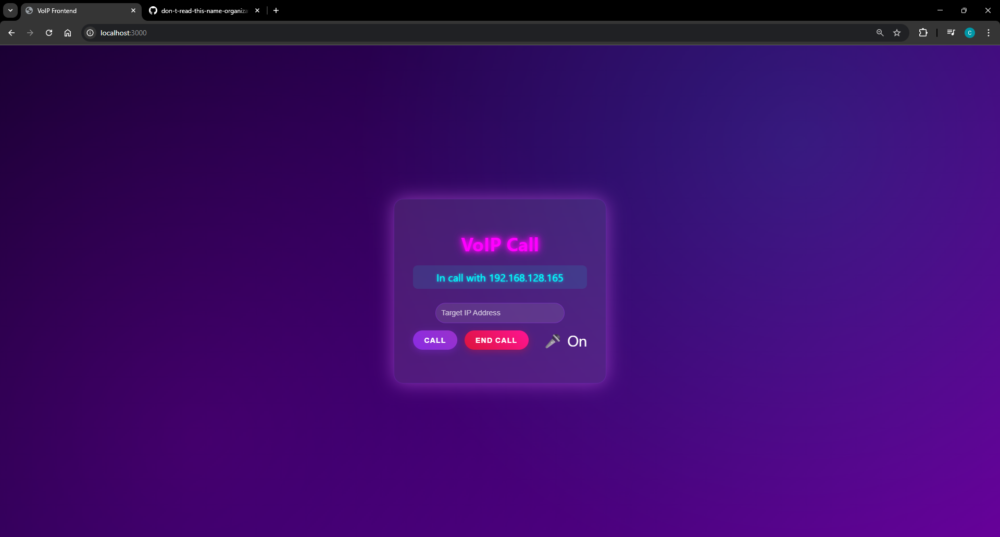

# Computer Networks Project

## Project Description

This project implements a Voice over IP (VoIP) application in Rust, demonstrating real-time audio streaming, UDP packet handling, jitter buffering, and WebSocket signaling. The application consists of a Rust backend that handles audio capture/playback, network communication, and a web-based frontend for user interaction.

The VoIP app allows users to make real-time voice calls over a network using UDP for audio data transmission and WebSockets for call signaling and control messages.

## Features

- Real-time audio capture and playback using CPAL
- UDP-based audio streaming
- Jitter buffer for handling network latency
- WebSocket signaling for call control
- Web-based user interface
- Asynchronous networking with Tokio

## Prerequisites

- Rust toolchain (install from https://rustup.rs/)
- Modern web browser with WebSocket support

## How to Run

1. Navigate to the `voip-app` directory:
   ```
   cd voip-app
   ```

2. Build and run the application:
   ```
   cargo run
   ```

3. Open your web browser and go to `http://localhost:3000`

4. Enter the target IP address of another instance running the app and click "Call" to initiate a VoIP call.

## Architecture

- **Backend (Rust)**: Handles audio I/O, UDP networking, jitter buffering, and WebSocket server
- **Frontend (Web)**: Simple HTML/CSS/JavaScript interface for call controls
- **Networking**: UDP for audio packets, WebSockets for signaling

## Dependencies

The project uses several Rust crates:
- `cpal`: Cross-platform audio library
- `tokio`: Asynchronous runtime
- `axum`: Web framework for the HTTP/WebSocket server
- `tokio-tungstenite`: WebSocket support
- `serde`: Serialization for control messages

## Screenshots


